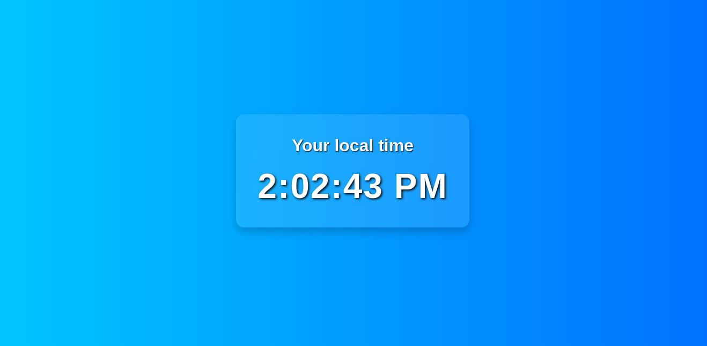

# 🕒 Local Time Web App

This is a simple and attractive web application that displays the current local time of the user in real-time using JavaScript. The interface is clean, responsive, and styled with modern CSS effects.

## 🌐 Demo

A live clock that updates every second, styled with a gradient background and glassmorphism effect.

![Screenshot]

